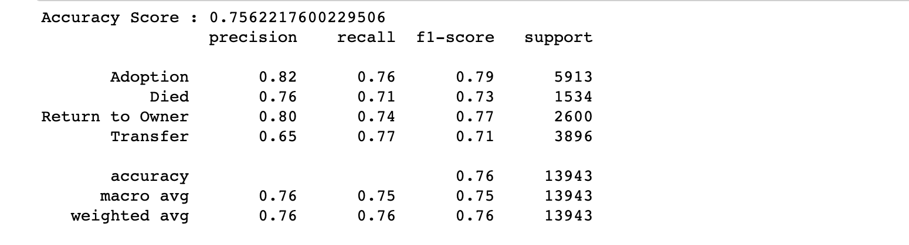
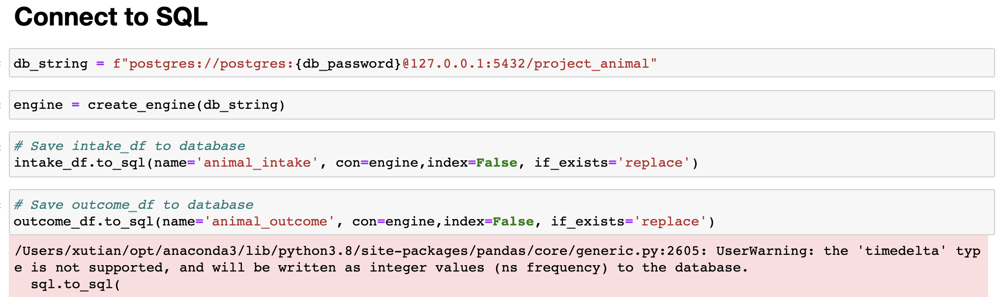

# Group_5_Animal_Adoption

The project dashboard is created in Google Slides, and can be viewed through the following link:
https://docs.google.com/presentation/d/1woJQrk37jf7KGV7xhvZCvFuRdxrqUlmahCp6gnrehiw/edit#slide=id.ge72201d6db_0_364

# Presentation

## Selected topic

The purpose of this analysis is to review data on animals in the Austin Animal Center to better understand the inventory of the animals and to create a model that predicts the outcome whether that is:

- Adoption
- Transfer
- Return to Owner
- Euthanesia
- Died

## Reason for selecting this topic

The Austin Animal Shelter is the largest no-kill animal shelter in the United States and houses 18,000 animals each year. The shelter is an open intake facility where all lost or surrendered animals are accepted. As the city of Austin grows the number of animal intakes will increase making the burden on the shelter greater. The ability of the shelter to remain no-kill is dependent on having available room to house all of the animals and makes understanding the outcome of the animals and the success of the adoption program incential.

## Source of Data

https://data.world/rdowns26/austin-animal-shelter

The data was sourced from https://data.world which was originally sourced from http://data.austintexas.gov. The data contains information on animal intakes and outcomes of the Austin Animal Shelter over a 3.5 year period.

## Questions we hope to answer with the data

- The distribution of stray animals in Austin.

- Which month has more adoptions?

- Which month does the shelter have the lowest capacity?

- Number of spay and nueter surgeries that the shelter needs to preform each year.

- The most important features that can effect its outcome.

- A review of other main factors and their correlation to the outcome. Such as:
  - length of stay
  - age
  - color
  - location of where they found

# GitHub

# Technology

### Data Cleaning and Analysis

Jupyter Notebook (Python, Pandas & sqlalchemy) will be used to clean the Pet Adoption data and to connect to Postgres.

### ERD

We used https://www.quickdatabasediagrams.com to create the ERD to show the relationship of the animal_intake and animal_outcome tables going to be used in Postgres.

### Database Storage

Postgres will be used to store the animal_intake and animal_outcome tables that we created from Jupyter Notebook.

### Dashboard

We will use Tableau to create an interactive Story to display our results.

### Machine Learning Model

We will be using K-Nearest Neighbors, RandomForest, and Gradient Boosting.

# Machine Learning Model

## Output label

Our target variable is Outcome_Type which is a classification variable that has many different classes.  During preprocessing this was reduced and combined to the following values:
- Adoption
- Died
- Return to Owner
- Transfer

## Preprocessing Data

During the preprocessing of the data: 
- bucketing was used on the breed_type and intake_color features to reduce the number of individual values. 
- get_dummies was used to encode the categorical values. 
- LabelEncoder was used to encode the target variable, outcome_type. 

## Feature Selection and Decision Making Process

We selected our features based on our knowledge of animal adoption trends. For example, the found location of an animal will not affect its outcome, therefore, we dropped found_location column for machine learning analysis.

## Training and Testing Data

- The data was split using the train_test_split function with the test set equaling 25% of the data. 
- The data was then scaled using the StandardScaler function to normalize the data.
- The data was then resampled using combination resampling method SMOTEEN to avoid class imbalance problem.

## Model Choice

For this type of target value, we used K-Nearest Neighbors, RandomForest and Gradient Boosting to determine the best model. The metrics of the models were evaluated using a confusion matrix and a classification report with an emphasis on precision and f-1 score. After the evaluation of the models, we choose RandomForestClassification model since that had the highest performance and the fastest runtime.

### Benefits

The benefits of RandomForestClassification are:
- It creates more decision tree so that can reduce overfitting problem.
- It’s able to handle multiple target variables regression problems.
- It’s able to handle outliers automatically.

### Limitations

- For large dataset, it requires much more computational powers since random forest creates a lot of trees.
- It also require much more time to train the data.

## Additional Training Process

The original target variables are:

- Adoption
- Died
- Euthanasia
- Missing
- Return to owner
- Transfer

However, as we can see in the figure below, the precision score for Died and Missing are 0.27 and 0.20, respectively. The reason for this is that the number of data point for Died and Missing categories are relatively low. We tried to adding more data in our model but it still cannot improve its performance much. Therefore, we decided to combine Died and Euthanasia categories to Died, and drop Missing category since only less than 1% of data shows “Missing”.

The final target variables became:

- Adoption
- Died
- Return to owner
- Transfer

## Accuracy score

The final result after training the model is shown above, the overall accuracy score for our model is 75.6%, and the precision score for all of the target variable are above 65%. Since our purpose is to predict whether or not an animal will be adopted based on characteristics upon intake in order to avoid experiencing tumult from having to turn away animals. Therefore, an accuracy score of 76% is good enough for our model. Also, the values of accuracy and precision are more important to us compared to recall.

# Database 

## Sample Data

- Sample data is saved as CSV file, and performed ETL process using Python Pandas library. (see link: [segment2_clean_data](https://github.com/kevinsguo/Group_5_Animal_Adoption/blob/main/Segment_2/segment2_clean_data.ipynb))

- The following features where transformed before loading the data into the database:
  - Removed unecessary columns
  - Intake Name was processed into a binary "Yes" or "No"
  - Duplicate rows of the Animal ID were removed.
  - Combined Outcome_Type for:
    - Disposal & Died = Died
    - Relocate & Transfer = Transfer
    - Rto-Adopt & Return to Owner = Return to Owner
  - Changed the data type of the DateTime_intake and DateTime_outcome to datetime
  - Created a DateTime_length column from DateTime_intake and DateTime_outcome to produce length of stay at the shelter.
    - Deleted all the negative invalid DateTime_length.
  - Combine IntakeCondition for:
    - Aged, Feral & Other = Other
    - Injured & Sick = Medical
    - Nursing & Pregent = Maternity
  - Combined Intake_Type for:
    - Bird, Livestock & Other = Other
  - Removed Found_Location that didn't have street address
  - Bucketed breed_intake into Breed Type categories
  - Bucketed color_intake into main color categories

- Cleaned dataset is connected and stored in PostgreSQL database using sqlalchemy.

  

## Provisional Database

- Database includes two tables as shown in below image (intake table and outcome table)

  

- The tables are inner joined on animal_id using SQL with following ERD relationships

  
  

- The resulting table is transformed back to Pandas DataFrame using sqlalchemy for analysis with machine learning models. 

  
  
  ## Visuals
  
  ### [Click here](https://public.tableau.com/app/profile/rebecca.weirich/viz/Animal_Adoption/Story1?publish=yes) for dashboard in Tableau
  
  ### Images from the initial analysis
  
  
  
  Animal Type Intake Count
  
  

Percent Animal Type Intake

Percent of Outcome Type

